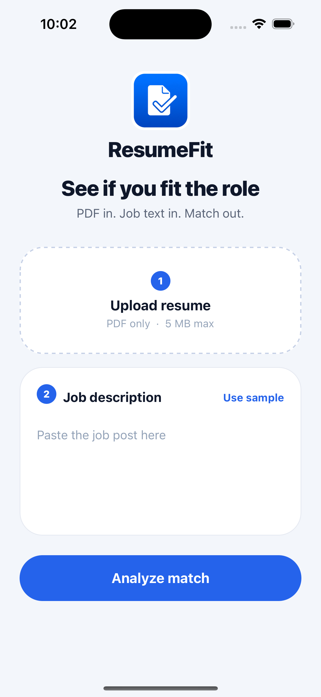
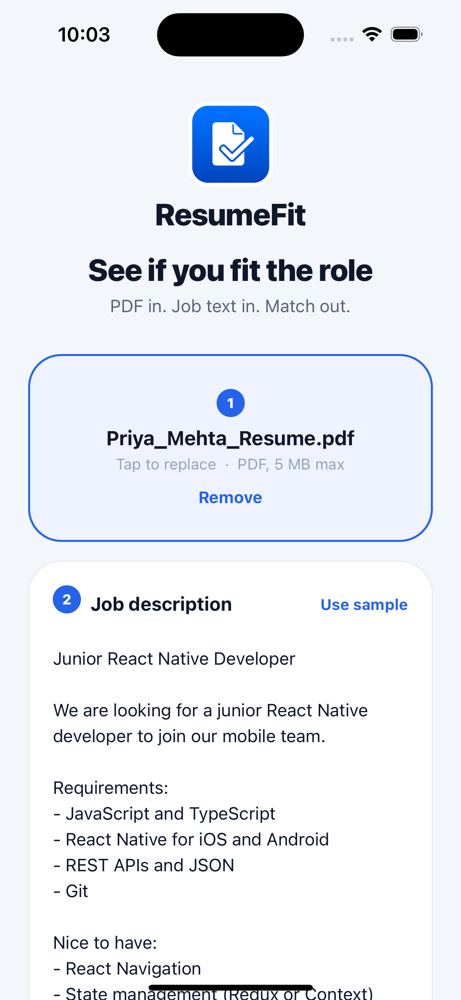
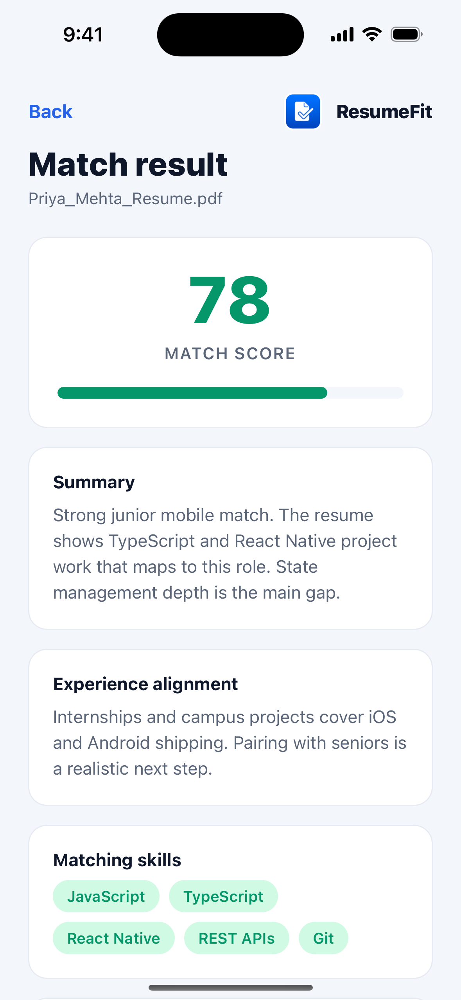
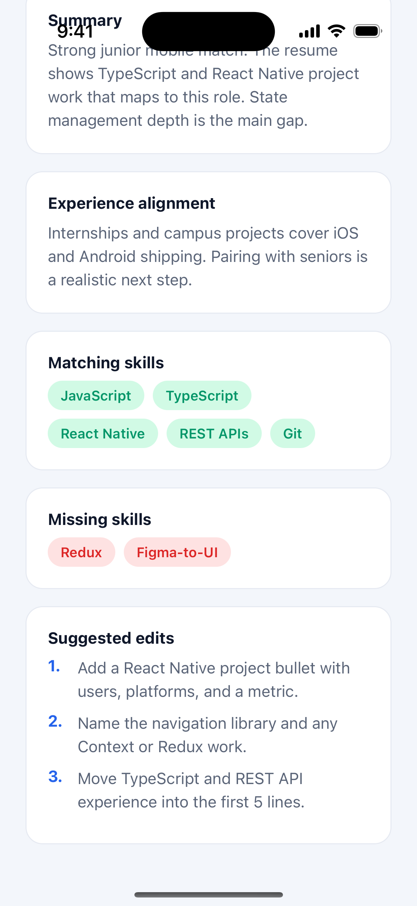

# ResumeFit

React Native CLI app (**not Expo**). Upload a PDF resume, paste a job description, and see how well they match using the **Google Gemini free API**.

There is **no backend**. The phone talks to Gemini directly. That is simpler for a classroom demo. In production you would hide the API key on a server.

| Input | Output |
| --- | --- |
| Resume PDF (max 5 MB) + job description text | Score 0–100, matching / missing skills, experience note, 3 resume edits |

Seminar materials: [`SEMINAR.md`](./SEMINAR.md) and [`ResumeFit-Seminar.pptx`](./ResumeFit-Seminar.pptx).

## Screenshots

<p>
  
  
  
  
</p>

| Screen | What it shows |
| --- | --- |
| Home | Empty upload card + job box + **Analyze match** |
| Home (ready) | Selected PDF + sample junior React Native JD |
| Result | 0–100 score, summary, experience alignment |
| Result (skills) | Matching / missing skill chips + 3 suggested edits |

---

## Architecture

```
Phone: pick PDF + paste job description
        ↓
keepLocalCopy → file:// URI
        ↓
uriToBase64 → PDF as text inside JSON
        ↓
POST Gemini generateContent (prompt + inline PDF)
        ↓
parseModelJson → ResumeAnalysis
        ↓
Result screen
```

The screens never talk HTTP. They call helpers in `src/api/`. Gemini is treated like any other REST API: **URL, key, request, response, error, quota**.

### Request shape

One `generateContent` call with two parts in the same message:

1. **Text** — recruiter prompt + the job description. The prompt asks for JSON only, with exact keys the Result screen already renders.
2. **PDF** — `inline_data` with `mime_type: application/pdf` and base64 bytes.

Model: `gemini-2.0-flash`. Temperature `0.2` so live-demo scores stay consistent. `responseMimeType` is `application/json`. The parser still strips markdown fences (` ```json `) because models sometimes wrap the payload anyway.

### Response shape (`ResumeAnalysis`)

```ts
{
  matchPercent: number;          // clamped 0–100
  summary: string;
  matchingSkills: string[];
  missingSkills: string[];
  experienceAlignment: string;
  suggestedEdits: string[];      // sliced to 3
}
```

### Why this folder layout

```
App.tsx                         # Gesture + SafeArea wrappers
index.js                        # AppRegistry entry
src/
  api/
    pickResume.ts               # OS file picker → local PDF copy
    gemini.ts                   # key, prompt, base64, fetch, JSON parse
  screens/
    HomeScreen.tsx              # collect inputs, validate, call analyze
    ResultScreen.tsx            # render ResumeAnalysis
  components/                   # Logo, MatchScore, SkillChips
  navigation/index.tsx          # native stack: Home → Result
  types/index.ts                # shared TS types (one source of truth)
  constants/sampleJob.ts        # demo JD for “Use sample JD”
  theme/index.ts                # colors, spacing, radius
android/  ios/                  # native projects (React Native CLI)
.env.example                    # GEMINI_API_KEY=  (copy to .env, never commit)
```

| File | Responsibility |
| --- | --- |
| `src/api/pickResume.ts` | `@react-native-documents/picker` — PDF only, `keepLocalCopy` so the URI does not expire |
| `src/api/gemini.ts` | All Gemini work. Screens do not know HTTP details |
| `src/screens/HomeScreen.tsx` | Product glue: pick → validate → base64 → analyze → navigate |
| `src/screens/ResultScreen.tsx` | Display only. Receives `analysis` + `fileName` as route params |
| `src/types/index.ts` | `ResumeAnalysis`, `PickedResume`, `RootStackParamList` |

### Analyze flow (Home)

1. User picks a PDF. Word files are rejected. Files over **5 MB** are rejected (the whole PDF rides in the JSON body).
2. User pastes a JD or taps **Use sample JD**.
3. Home checks: resume present, JD not empty, `GEMINI_API_KEY` present.
4. `uriToBase64` reads the local file and strips the `data:...;base64,` prefix.
5. `analyzeResumeMatch` POSTs to Gemini. Google’s error message (quota, bad key, safety) is shown as-is.
6. `parseModelJson` clamps the score and fills missing arrays so the UI cannot crash on `undefined`.
7. Navigation opens **Result** with the typed payload.

### Secrets

`react-native-dotenv` injects `.env` as `@env` at **build** time (`babel.config.js`). Changing the key requires a Metro restart / rebuild. `.env` is gitignored. Commit only `.env.example`.

---

## Prerequisites

- Node **22.11+**
- npm
- [React Native 0.87 environment](https://reactnative.dev/docs/set-up-your-environment)
  - **Android:** JDK 17+, Android Studio, SDK, a device or emulator
  - **iOS (macOS):** Xcode, CocoaPods (`bundle exec pod install`)
- A free Gemini key from [Google AI Studio](https://aistudio.google.com/apikey)

---

## Setup

From the project root:

### 1. Clone and install JavaScript deps

```bash
git clone https://github.com/teqgrid/resume-fit.git
cd resume-fit
npm install
```

### 2. Add your Gemini key

```bash
cp .env.example .env
```

Edit `.env` (no quotes):

```
GEMINI_API_KEY=your_key_here
```

Restart Metro after any `.env` change.

### 3. iOS pods (macOS only)

```bash
bundle install
cd ios && bundle exec pod install && cd ..
```

---

## Run on a simulator / emulator

Terminal 1 — Metro:

```bash
npm start
```

Terminal 2:

```bash
npm run ios
# or
npm run android
```

---

## Run on a real phone

Keep the phone on the **same Wi‑Fi as the Mac**, or use USB. Metro must stay running.

### Android (USB)

On the phone:

1. Settings → About phone → tap **Build number** 7 times.
2. Developer options → **USB debugging** on.
3. Plug in USB. Tap **Allow** / File transfer (MTP).

On the computer:

```bash
adb devices          # must show a device id
npm start            # leave this running
```

In another terminal:

```bash
adb reverse tcp:8081 tcp:8081
npm run android
```

`adb reverse` lets the phone reach Metro on the computer over USB.

### iPhone (USB + Xcode signing)

You need a free Apple ID signed into Xcode.

1. Plug in the iPhone. Unlock. Tap **Trust**.
2. Settings → Privacy & Security → **Developer Mode** → On (restart if asked).
3. Xcode → Settings → Accounts → add your Apple ID.
4. Open `ios/ResumeFit.xcworkspace` (the **workspace**, not `.xcodeproj`).
5. ResumeFit target → Signing & Capabilities → **Automatically manage signing** → choose your Team.
6. Pick the physical iPhone as the run destination. Press Run.
7. On the phone: Settings → General → VPN & Device Management → trust your Apple ID.

Then, with Metro already running:

```bash
npx react-native run-ios --device
```

Allow **Local Network** the first time so the app can load JS from the Mac.

### Red box: “Could not connect to Metro”

- Android: `adb reverse tcp:8081 tcp:8081`, then shake → Reload.
- iPhone: same Wi‑Fi, allow Local Network, shake → Reload.
- Confirm Metro is running: `npm start` in the project folder.

---

## Try the app

1. Tap **Choose PDF** and pick a resume.
2. Keep or replace the sample job description (**Use sample JD**).
3. Tap **Analyze match**.
4. Result shows a 0–100 score, matching / missing skills, experience alignment, and 3 suggested edits.

---

## Tests

```bash
npm test
```

| Test | What it proves |
| --- | --- |
| `__tests__/App.test.tsx` | App mounts (gesture-handler and navigator are mocked) |
| `__tests__/gemini.test.ts` | `parseModelJson` strips ```json fences |
| `__tests__/gemini.test.ts` | `matchPercent` of `140` is clamped to `100` |

Jest maps `@env` to `__mocks__/env.js` so tests do not read a real key.

Lint:

```bash
npm run lint
```

---

## Classroom notes

- PDF only, max 5 MB. Each student should use their **own** Gemini key.
- Do not commit `.env` or ship a public app with a hardcoded key.
- Gemini free-tier rate limits are fine for a demo, not for a production ATS.
- If Gemini wraps JSON in markdown fences, the app strips them before parsing.
- Teaching script: [`SEMINAR.md`](./SEMINAR.md). Open these four files with students: `src/api/gemini.ts`, `src/api/pickResume.ts`, `src/screens/HomeScreen.tsx`, `src/screens/ResultScreen.tsx`.

---

## Scripts

| Command | What it does |
| --- | --- |
| `npm start` | Metro bundler |
| `npm run android` | Build and run on Android |
| `npm run ios` | Build and run on iOS |
| `npm test` | Jest |
| `npm run lint` | ESLint |
